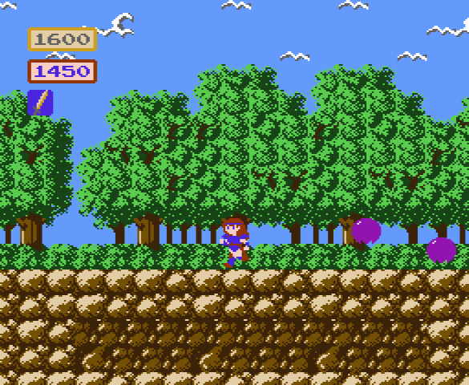

# OpenMadoola

Free software (GPL v2.0 or later) reimplementation of "The Wing of Madoola"



## Usage

OpenMadoola will look for a Wing of Madoola ROM image named "madoola.nes" in the current working directory (its directory if you're not running it from the command line). It gets all the graphics and level data from the ROM image, and will refuse to start if it is not present. It will also need the font.bin and nes.pal files from this repository.

OpenMadoola will save data to the current working directory. There's currently no way to change that, so sorry to everyone who likes to install stuff to /usr/local/bin.

### Default controls
Keyboard | Gamepad (xbox layout) | Equivalent NES button
-------- | --------------------- | ---------------------
W | D-Pad Up | D-Pad Up
S | D-Pad Down | D-Pad Down
A | D-Pad Left | D-Pad Left
D | D-Pad Right | D-Pad Right
J | X | B
K | A | A
Right Shift | Back | Select
Enter | Start | Start

You can change the controls in the options menu. Pressing A+B+Select+Start in-game will exit to the title screen.


## Build Instructions

### GNU/Linux or Mac OS X

Install GCC or Clang, make, cmake, and the SDL2 development libraries from your package manager.

Generate the build files with
```
cmake -B build -DCMAKE_BUILD_TYPE=Release
```

Next, compile the executable with this command:
```
cmake --build build --config Release
```

### Windows

Install [Visual Studio](https://visualstudio.microsoft.com/downloads/) and [cmake](https://cmake.org/download/).

Download the latest SDL2 VC development version from [here](https://github.com/libsdl-org/SDL/releases). Unzip the file into libs\\SDL2, making sure that you go down a level so the top-level directories in the folder are docs\\ include\\ libs\\ etc.

Run cmake on the checked out source directory, then open the generated solution in Visual Studio.

Note that I don't check if the project builds with Visual Studio in between releases, so if you check out from master it's possible that the project won't build without changes. If you make a PR with the required changes, that would be appreciated.


## Used Software
### sdl2 http://libsdl.org/
```
Copyright (C) 1997-2020 Sam Lantinga <slouken@libsdl.org>
  
This software is provided 'as-is', without any express or implied
warranty.  In no event will the authors be held liable for any damages
arising from the use of this software.

Permission is granted to anyone to use this software for any purpose,
including commercial applications, and to alter it and redistribute it
freely, subject to the following restrictions:
  
1. The origin of this software must not be misrepresented; you must not
   claim that you wrote the original software. If you use this software
   in a product, an acknowledgment in the product documentation would be
   appreciated but is not required. 
2. Altered source versions must be plainly marked as such, and must not be
   misrepresented as being the original software.
3. This notice may not be removed or altered from any source distribution.
```

### Nes_Snd_Emu http://www.slack.net/~ant/libs/
```
Copyright (C) 2003-2005 Shay Green. This module is free software; you
can redistribute it and/or modify it under the terms of the GNU Lesser
General Public License as published by the Free Software Foundation; either
version 2.1 of the License, or (at your option) any later version. This
module is distributed in the hope that it will be useful, but WITHOUT ANY
WARRANTY; without even the implied warranty of MERCHANTABILITY or FITNESS
FOR A PARTICULAR PURPOSE. See the GNU Lesser General Public License for
more details. You should have received a copy of the GNU Lesser General
Public License along with this module; if not, write to the Free Software
Foundation, Inc., 59 Temple Place, Suite 330, Boston, MA 02111-1307 USA
```


### nanotime https://github.com/nightmareci/nanotime
```
This is free and unencumbered software released into the public domain.

Anyone is free to copy, modify, publish, use, compile, sell, or distribute
this software, either in source code form or as a compiled binary, for any
purpose, commercial or non-commercial, and by any means.

In jurisdictions that recognize copyright laws, the author or authors of
this software dedicate any and all copyright interest in the software to the
public domain. We make this dedication for the benefit of the public at
large and to the detriment of our heirs and successors. We intend this
dedication to be an overt act of relinquishment in perpetuity of all present
and future rights to this software under copyright law.

THE SOFTWARE IS PROVIDED "AS IS", WITHOUT WARRANTY OF ANY KIND, EXPRESS OR
IMPLIED, INCLUDING BUT NOT LIMITED TO THE WARRANTIES OF MERCHANTABILITY,
FITNESS FOR A PARTICULAR PURPOSE AND NONINFRINGEMENT.  IN NO EVENT SHALL THE
AUTHORS BE LIABLE FOR ANY CLAIM, DAMAGES OR OTHER LIABILITY, WHETHER IN AN
ACTION OF CONTRACT, TORT OR OTHERWISE, ARISING FROM, OUT OF OR IN CONNECTION
WITH THE SOFTWARE OR THE USE OR OTHER DEALINGS IN THE SOFTWARE.

For more information, please refer to <http://unlicense.org/>
```
